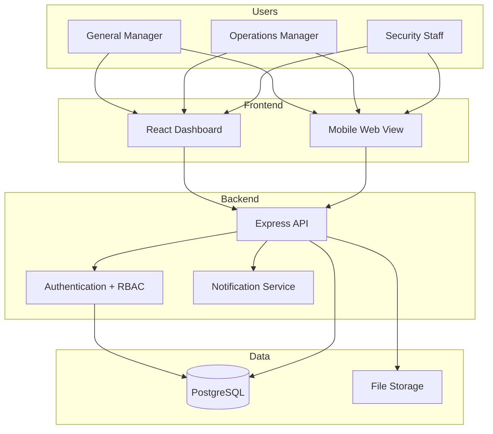

# 🏬 MallOS

### Mall management system with role-based authentication and operational monitoring

*Multi-role auth • Real-time monitoring • Operational analytics • Node.js + React*

[-339933?style=for-the-badge&logo=node.js&logoColor=white)](https://nodejs.org/)

[Features](#-features) • [Architecture](#-architecture) • [Roles](#-role-hierarchy) • [Contact](#-contact)

---

## 💡 Overview

**MallOS** is a web-based management system for shopping mall operations. It provides role-based dashboards for operations teams, security staff, and management with real-time monitoring capabilities and operational workflow tools.

---

## ✨ Features

### 🔐 Authentication & Access Control
- **Multi-role login** — General Manager, Operations Manager, Security Guard
- **Two-factor authentication (2FA)** for management roles
- **Role-based dashboards** — tailored interface per user role
- Session management with activity logging

### 📊 Operational Modules
- **Tenant management** — lease tracking, contact information, status updates
- **Security incidents** — incident logging with photo/video evidence
- **Maintenance tracking** — ticket workflow, priority management, completion status
- **Visitor analytics** — footfall data, peak hours analysis, trends

### 📡 Real-Time Monitoring
- **Live dashboards** with auto-refresh capabilities
- **Alert notifications** for critical issues
- **Status monitoring** across operational areas
- **Performance metrics** tracking

---

## 🏛️ Architecture

---

## 👥 Role Hierarchy

| Role | Access Level | Capabilities |
|---|---|---|
| **General Manager** | Full system access | Financial reports, tenant decisions, system configuration |
| **Operations Manager** | Operations + Analytics | Maintenance oversight, performance reports, staff coordination |
| **Security Staff** | Security + Incidents | Incident logging, patrol tracking, basic reporting |

---

## 🛠️ Tech Stack

| Component | Technology |
|---|---|
| **Frontend** | React, TypeScript, Tailwind CSS |
| **Backend** | Node.js, Express, TypeScript |
| **Database** | PostgreSQL |
| **Authentication** | JWT with TOTP-based 2FA |
| **File Handling** | Multer for uploads |
| **Real-time** | WebSocket for live updates |

---

## 🚀 Key Implementation Features

- **Role-based routing** — React Router with permission guards
- **Real-time updates** — WebSocket connections for live dashboard data
- **File upload handling** — Secure document and image storage
- **Responsive design** — Mobile-friendly interface for field staff
- **Audit logging** — All user actions tracked for compliance

---

## 📄 Status & Licensing

**Status:** Production system deployed and operational  
**Code:** Proprietary - architecture documented here for demonstration

**Available for:**
- 🏢 Mall operator licensing and customization
- 🛠️ Feature enhancement and integration work
- 🤝 Technical consultation on similar systems

---

## 📬 Contact

📧 **moslehmohammad2@gmail.com**  
🐙 **[github.com/Mosleh92](https://github.com/Mosleh92)**

---

*Production mall management system — built for operational efficiency*

