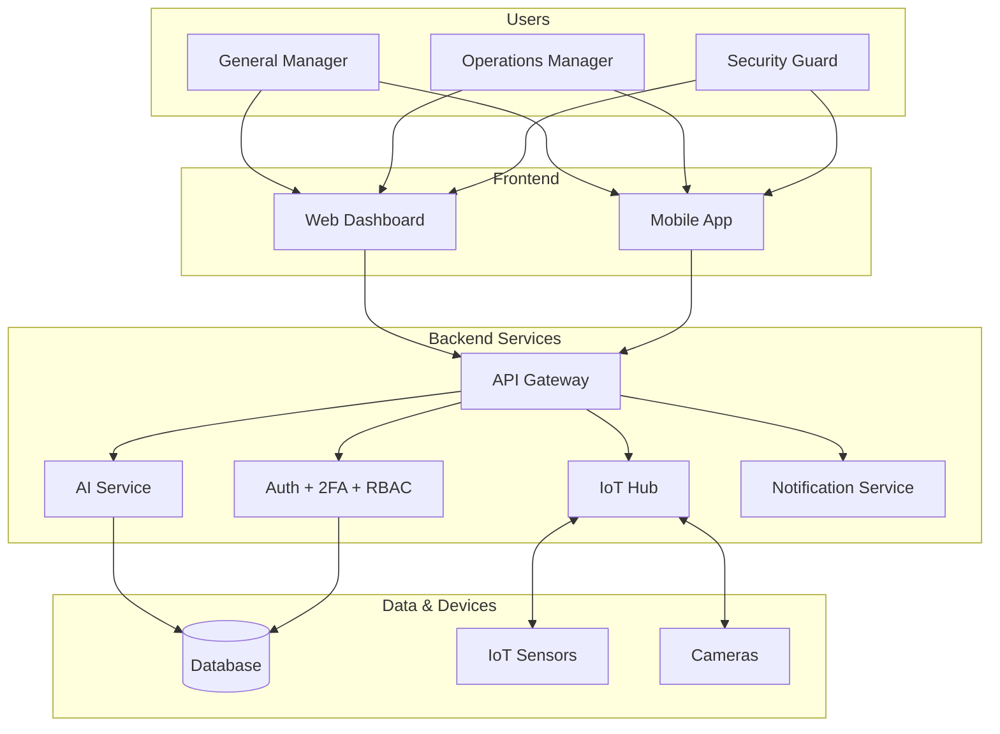

# 🏬 MallOS Enterprise

### AI + IoT Powered Shopping Mall Management System

*Multi-role auth • Real-time monitoring • Predictive analytics • Built for enterprise scale*

[Features](#-features) • [Architecture](#-architecture) • [Roles](#-role-hierarchy) • [Licensing](#-licensing--contact)

---

## 💡 Overview

**MallOS Enterprise** is an integrated management system for modern shopping malls. It combines **artificial intelligence**, **IoT sensors**, and **role-based operational tooling** to give mall operators full visibility — from security cameras to tenant performance to predictive maintenance — in one unified platform.

> Built for enterprise mall operators who need to coordinate operations, security, tenants, and analytics in real-time.

---

## ✨ Features

### 🔐 Advanced Authentication System
- **Multi-role login** — General Manager, Operations Manager, Security Guard
- **Two-factor authentication (2FA)** for managers
- **Role-based dashboards** — each user sees only what they need
- Session management with audit trail

### 🤖 AI Capabilities
- Visitor flow prediction
- Anomaly detection in security feeds
- Tenant performance insights
- Automated alert routing

### 📡 IoT Integration
- Real-time sensor monitoring (HVAC, lighting, occupancy)
- Predictive maintenance alerts
- Energy consumption optimization
- Centralized device management

### 📊 Operational Modules
- Tenant management & lease tracking
- Security incident logging
- Maintenance ticket workflow
- Visitor analytics dashboards

---

## 🏛️ Architecture

---

## 👥 Role Hierarchy

| Role | Capabilities |
|---|---|
| **General Manager** | Full system access, financial reports, tenant decisions |
| **Operations Manager** | Maintenance, visitor analytics, IoT alerts |
| **Security Guard** | Incident logging, camera feeds, patrol checkpoints |

---

## 🛠️ Tech Stack

| Layer | Technology |
|---|---|
| **Frontend** | TypeScript, React, Tailwind CSS |
| **Backend** | Node.js, TypeScript |
| **Auth** | JWT + TOTP-based 2FA |
| **AI** | Integrated ML services |
| **IoT** | MQTT / WebSocket sensor bridge |

---

## 📸 Screenshots

> 🖼️ *Coming soon — manager dashboard, security console, IoT live view.*

---

## 📄 Licensing & Contact

This is **proprietary commercial software**. See [LICENSE](./LICENSE).

**Available for:**
- 🏢 Mall operator licensing & deployment
- 🛠️ Customization for specific operational needs
- 🤝 IoT vendor integration partnerships

📧 **moslehmohammad2@gmail.com**
🐙 [github.com/Mosleh92](https://github.com/Mosleh92)

---

⭐ *Star this repo if you find it useful!*

